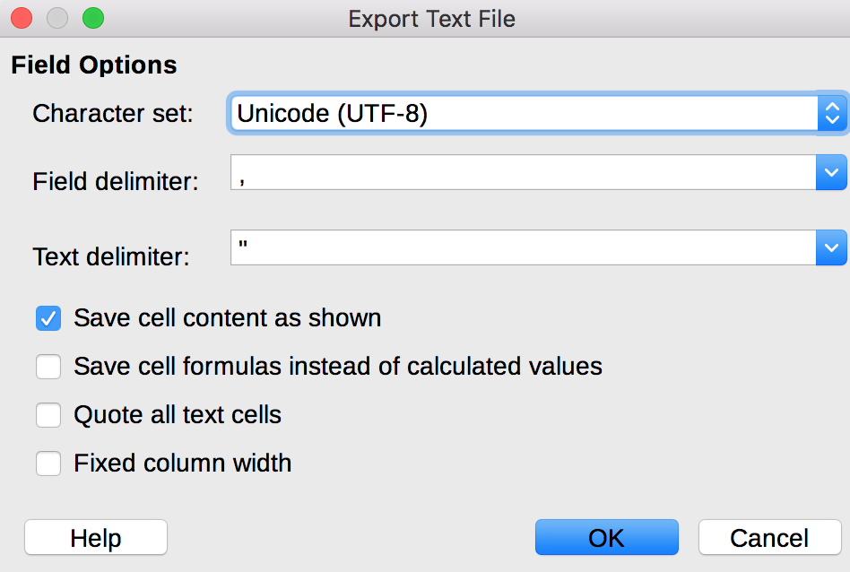

# CSV Guidelines: Prose
Welcome to the Library of Digital Latin Texts project. These guidelines are intended to give you a general overview of how the CSVs you produce will be used, and to provide you with the specific encoding procedures for the CSV version of the critical apparatus for prose texts.
## General overview
The goal of our project is to produce an XML-encoded version of a Latin critical edition. When finished, these digital critical editions will be open source and freely available to the public. XML is a markup language which encodes information about a text within the text itself. XML encoding by hand is tedious and time-consuming, so we use Python scripts to automate the process. These scripts take as input a plain text file of the editor’s text and a CSV (comma separated values) file with critical apparatus entries. Your job is to produce this CSV file (basically just a spreadsheet) from a printed critical edition. Because you are creating the input for an automated script, it is important to follow the punctuation and formatting guidelines presented in this document as exactly as possible.
## CSV Overview
A CSV (comma separated values) is, essentially, a very basic spreadsheet. It is usually easiest to edit your CSV in spreadsheet software and then export it as a text CSV. You should use software other than Microsoft Excel, because Excel will insert some Microsoft-specific markup that is hard to process. I like LibreOffice (free and available here: https://www.libreoffice.org/download/download/) but you can use whatever works for you.
### Specifications for the CSV file
Your work should be saved as a text CSV file, with UTF-8 encoding. The column delimiter should be the comma (,), and the text delimiter should be double quotes ("). Both of these are handled in the document settings, so you won't have to type them. If you're using LibreOffice, the correct document settings look like this:

### LDLT CSV Format
The required CSV format for prose has a total of 31 columns. The column headings are as follows: Paragraph, Section, Lemma, Lemma_Witnesses, Lemma_Sources, Lemma_Annotations, General_Comment, Reading_1, Reading_1_Witnesses, Reading_1_Sources, Reading_1_Annotations, Reading_2, Reading_2_Witnesses, Reading_2_Sources, Reading_2_Annotations, Reading_3, Reading_3_Witnesses, Reading_3_Sources, Reading_3_Annotations, Reading_4, Reading_4_Witnesses, Reading_4_Sources, Reading_4_Annotations, Reading_5, Reading_5_Witnesses, Reading_5_Sources, Reading_5_Annotations, Reading_6, Reading_6_Witnesses, Reading_6_Sources, Reading_6_Annotations.

It is important that the columns have these names, and absolutely essential that they appear in this exact order. The number of readings is flexible, so if you have more than 6 readings for any lemma, you can just add a Reading_7 (or as many additional reading columns as necessary). If you add additional columns, you must add all 4 columns (Reading_X, Reading_X_Witnesses, Reading_X_Sources, Reading_X_Annotations) for each additional reading, regardless of whether they are used.

## Column-by-column formatting guidelines
This section will discuss each column of the CSV in detail, including what goes in that column and the formatting and punctuation guidelines for each type of data.

### Column 1: Paragraph
The paragraph number goes here. It should be digits only, with no spaces, punctuation, or other characters.

### Column 2: Section
The section or sentence number goes here. Again, it should be digits only, with no spaces or other characters.

### Column 3: Lemma
The lemma for the critical apparatus entry goes here. This is reading that the editor believes to be correct, and therefore the reading that they print in their text. It is important that the text you enter in the lemma column exactly matches the lemma as it appears in the base text, so that the script can find and replace it. For example, if the base text says "iuuenis", your lemma entry should say "iuuenis" and not "iuvenis". There are 3 special cases you are likely to see with lemmas:

#### Lacunae
In the case that there is a lacuna in the lemma (i.e. the editor believes text has been lost, but other witnesses or editors disagree), you should put "<gap reason="lost"/>" where the lacuna is in the lemma. This <gap> tag can be surrounded with text on either side, if necessary. For example:
> this is my <gap reason="lost"/\> lemma text

#### Multiple occurrences of lemma text
In the case where the full lemma text occurs multiple times in the sentence/section, it is necessary to explicitly specify to which occurrence the apparatus entry applies. The markup for this is: "word(1)" for the first occurrence, "word(2)" for the second, and so on. Note that there is no space between the word and the parentheses. You are most likely to see this for conjunctions and prepositions like et, sed, in, ab, ad, etc. iii.

#### Editorial additions
In cases where the editor has added a word or words, they should be surrounded with angle brackets, <>. For example:
> these are some <added\> words.

### Column 4: Lemma_Witnesses
Witnesses are manuscripts which contain the reading in question (in this case, the lemma). Each witness is designated with a siglum, which is usually a capital letter, but can also be designated with a Greek letter. Manuscript sigla should be encoded separated by spaces, e.g. "A B C". There are some special cases for encoding witnesses, which are as follows:

#### Corrected or changed manuscripts
In many cases, manuscripts have been changed or corrected many times. Our script currently handles 5 types of manuscript correction: _ante correctione_ (ac), _post correctionem_ (pc), _supra lineam_ (spl), _sub lineam_ (sbl), in margin (inmg). In these five cases, the abbreviation should go in parentheses immediately after the siglum, with no space in between. For example, if the lemma comes from the corrected version of manuscript A and the pre-correction version of manuscript B, then you should enter "A(pc) B(ac)" column 4. The script can only handle one of these abbreviations per siglum, so choose the most specific one for the correction in question, and if necessary, put the Latin (not the abbreviation) for the others in column 6, Lemma_Annotations.

#### 'mr' (Manus Recentior)
'mr' stands for _manus recentior_, and means a later hand writing in the same manuscript. It should be encoded with the siglum immediately followed by 'mr'. For example, a later hand in manuscript A would be encoded "Amr". Please note that this is different from 3.d.i because there are no parentheses. Also note that there is no whitespace between the siglum and the 'mr'.

#### Multiple hands in a manuscript
For multiple hands in the same manuscript, use the manuscript siglum, immediately followed by "h" and then the number. For example, use "Ah1" for the first hand in manuscript A, or "Bh2" for the second hand in manuscript B. Note that there are no spaces between the siglum, the "h", and the number.

#### Multiple manuscripts from one collection
For numbered manuscripts from the same collection, use the siglum, immediately followed by "ms" and then the number. For example, use "Ams1" for the first manuscript in collection A, or "Bms2" for the second manuscript in B. Note that there are no spaces between the siglum, the "ms", and the number.

#### Ed. Pr.
Occasionally, you will see "ed. pr." among the sigla for a lemma. This means the first printed edition, and is considered a witness, not a source. It should be encoded "ed.pr.", with no space in between.

#### Other annotations
In general, other types of subscripts and superscripts should be entered in line with the siglum, not separated from the siglum by whitespace.

### Column 5: Lemma_Sources
Sources are modern editors who believe the lemma is the correct reading. Enter their last names, separated by one space, e.g. "Name AnotherName". Sometimes, you will see the phrase "Name teste AnotherName". This means that AnotherName agrees with Name's reading. In this case, "AnotherName" goes in Column 5, and "Name teste" should go in Column 6, Lemma_Annotations.

### Column 6: Lemma_Annotations
These are the editor's comments about the lemma. Usually, they are references to similar wording in other works. Most of the time, you can just copy and paste these notes into column 6. There are 2 special cases with notes:

#### Alternate spellings
Occasionally, the editor will want to note an alternate spelling of the lemma in one manuscript, without considering it as a totally separate reading. In this case, the critical apparatus would say something like "hae [heae M] MUTV". Here, "hae" is the lemma, "M U T V" are the witnesses, and "[heae M]" is a note. The note should be encoded "[M heae]". It is important that a note which contains an alternate spelling is in square brackets, and that the siglum of the witness is immediately after the opening bracket and is followed by a space.

#### Multiple Notes
If there are multiple notes on a lemma, they should be separated with a forward slash preceded and followed by spaces, i.e. "this is a note / another note". If an alternate spelling note is necessary, it should be separated from other notes using this markup, e.g.:
> this is a note / [X spelling]

### Column 7: General Comments
This column contains general comments about the critical apparatus entry. These notes can be copy-pasted directly into the CSV. There is no special markup for this column.

### Columns 8, 12, 16, 20, 24, 28: Reading_X
In general, the guidelines for the reading columns are the same as the guidelines for the corresponding lemma columns. Therefore, these sections will only cover differences and additions to the lemma guidelines.

Readings are encoded in the same way as lemmas, and the special cases in 3.C still apply. There are three additional special cases which pertain to readings:
#### Omissions
An omission means that a word or words are completely omitted from a witness. In this case, all of the omitted words should be the lemma, and the reading should simply be "om." with no spaces.

#### Editorial Deletions
An editorial deletion means that text is present in a manuscript, but an editor believes it shouldn't be. This is usually denoted with "secl." in the critical apparatus. An editorial deletion is encoded by enclosing putting "secl." in the reading column.

#### Alternate spellings
Sometimes, an editor will include two alternate spellings of the word in one reading. Such a reading will look like: "religion(e/i)s". In this case, it can be encoded in the Reading_X column as is, with the parentheses and forward slash included. The editor may also provide a note about which witness has which spelling. In this case, they should be encoded according to the instructions in 3.F.ii.

### Columns 9, 13, 17, 21, 25, 29: Reading_X_Witnesses
These are encoded exactly the same way as the lemma witnesses are. See section 3.d above.

### Columns 10, 14, 18, 22, 26, 30: Reading_X_Sources.
Again, reading sources are encoded exactly the same way as the lemma sources are. See section 3.e above.

### Columns 11, 15, 19, 23, 27, 31: Reading_X_Annotations
The same encoding guidelines apply as in section 3.f above. The only additional thing is notes that go before readings. Usually, these are just "an" or "vel" and are used to signify the editor's tentative conjecture. These should be the first note listed in the Reading_X_Annotations column, and should be separated from other notes with " / " as described above. Other than that, no special markup is required.

## Helpful tips
1. I find it easiest to work in a spreadsheet editor, and to save my work in a spreadsheet format (.xlsx, .ods, etc.) until the CSV is finished. This allows me to highlight in yellow the entries or cells I am unsure about, so I know what I need to ask questions about. Once my questions are answered and I am confident that everything is correct, I save it as a text CSV, with the encoding and setup described in 2.a.
2. Try to avoid using semi-colons ; in the annotation columns, as this seems to cause notes to split across multiple columns. I'm still working on this issue.
3. If you have questions, I am happy to help. I've been doing this encoding work for about a year, so I can probably answer a lot of your questions. You can email me at katy.felkner@ou.edu.
